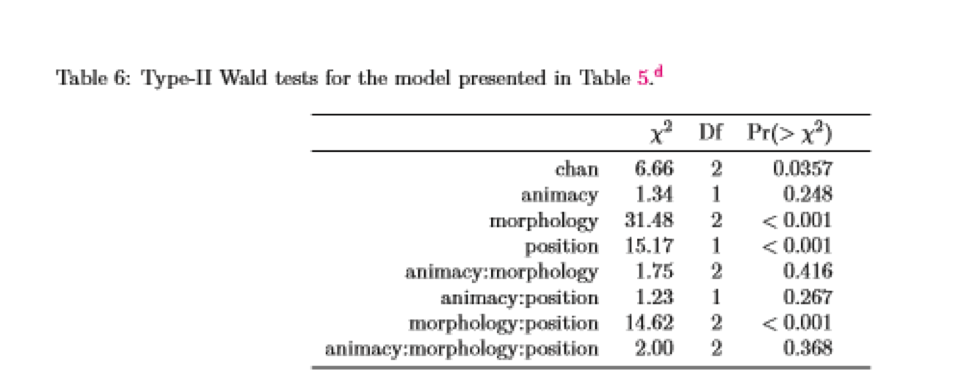

```{r setup, include=FALSE}
knitr::opts_chunk$set(echo = FALSE)
library(lme4)
library(languageR)
library(tidyverse)
library(effects)

lexdec_Cor <- lexdec %>% filter(Correct == 'correct' )

```

## Interpreting models: Interactions

Main effects in models are just what you think they are: the effect of some predictor x on some dependent variable y.

Interactions are what happens when a predictor (x1) and another predictor (x2) do not independently affect y.

- If there is non-independence, then the main effect becomes less meaningful: we can't ignore the other predictor.
   
- This is why interactions are considered to be 'higher order' terms.
   

## Implementing interactions

To put an interaction in a model in R, you combine with the operator *

This tells R to put in all main effects, and all interactions between them (here, as fixed effects)

- Automatically includes both higher order and lower order terms.

```{r m1, echo = TRUE}
m1 <- lmer ( RT ~ 1 + NativeLanguage * Frequency +
               (1 + Frequency | Subject) +  
               (1 + NativeLanguage | Word), 
             data=lexdec_Cor, control=lmerControl(optimizer="bobyqa"), REML=F)
summary(m1)
```
   
   
## Interaction plots

Interaction plots have two x variables-- here, one's in panels and one is on the x-axis. I extracted effects with the effects() package.

```{r m2, echo = TRUE}
plot(effect('NativeLanguage:Frequency',m1))
```

## Interaction plots

An interaction reflects non-independence. Graphically, this means that there will be some way to portray your data where the variables make non-parallel lines.

Here, we can see that the effect of frequency is stronger (steeper line) for NativeLanguage = Other than for NativeLanguage = English

```{r m3, echo = TRUE}
plot(effect('NativeLanguage:Frequency',m1))
```

## Main effects and interactions

While frequency matters for everyone (= it has a main effect), note that looking at just frequency is misleading-- it matters for one group more than the other.

- (Fortunately, the effects package gives you a little warning about this!: see below)

- In the earlier model, we showed that the main effect of Frequency had an estimate of -0.03. This is the slope of the line.  That is what a main effect means: just a slope.

- Slope of a line= (rise/run) = ~ (6.5 - 6.3)/(2-8) = -0.03
      
   
```{r m4, echo = TRUE}
plot(effect('Frequency',m1))
```

## An extreme example:

Why you should interpret interactions first is that the overall effect *can be the exact opposite* of the group-level effects.

This is known as Simpson's Paradox. The effect per level here (visualized per Simpsons' character) is the opposite of the overall effect.


from https://www.analyticsindiamag.com/wp-content/uploads/2018/12/simpsons-paradox.jpg

## What does an interaction term mean?

An interaction reflects how much different two slopes are from each other. 

The estimate for our interaction is -0.03.

- The effect for English is about (6.4 - 6.25)/(2 - 8) = -0.03
    
- The effect for Other is about (6.65 - 6.3)/(2 - 8) = -0.06
    
- Other is about 0.03 units steeper than English.
      
```{r m5, echo = TRUE}
plot(effect('NativeLanguage:Frequency',m1))
```


## What does an interaction term mean?

This means: interactions in mixed effect models can be *directly interpreted*

They have meaning in and of themselves-- unlike in an ANOVA.

- Main effects are slopes.

- Interaction effects are differences between slopes as a function of another predictor.

This relates to some points we will cover in the next section. 


## Main effects and interactions: What are sums of squares?

To look at how main effects differ from interactions, we are going to go into depth here on how the ANOVA sausage is made. This will let us make a comparsion to mixed modelsl and in doing so, get a deeper understanding of the difference between main effects and interactions.

In MEM vs ANOVA designs, interactions are interpreted a little bit differently. In fact, there are really three ways of calculating the variance terms in an ANOVA (sum of squares), depending on the order you have put the terms in.

As a note, ANOVA is also a way of tabulating your data. You can, in fact, make an ANOVA table of a mixed-effect model with some simple code. This tabulates where the variability occurs for groups in the data (for the ANalysis Of VAriance).

```{r m6, echo = TRUE}
anova(m1)
```

## What are sums of squares?

Sums of squares are the sum of squared variability from the mean for one cell of data (one group). 

Because it involves aggregating, it can matter what goes in first-- especially if the data are not balanced (if there are more observations in one group than the other).

This data set is such a case: we have more observations in NativeLanguage = English than Other.

```{r m7, echo = TRUE}
m1 <- lmer ( RT ~ 1 + NativeLanguage * Frequency +
               (1 + Frequency | Subject) +  
               (1 + NativeLanguage | Word), 
             data=lexdec_Cor, control=lmerControl(optimizer="bobyqa"), REML=F)
anova(m1)
```

## What are sums of squares?

Note how the two main effects in the ANOVA table changes based upon what's entered first in this model.


```{r m8, echo = TRUE}
m1 <- lmer ( RT ~ 1 + NativeLanguage * Frequency+
               (1 + Frequency | Subject) +  
               (1 + NativeLanguage | Word), 
             data=lexdec_Cor, control=lmerControl(optimizer="bobyqa"), REML=F)

anova(m1)

m2 <- lmer ( RT ~ 1 + Frequency * NativeLanguage +
               (1 + Frequency | Subject) +  
               (1 + NativeLanguage | Word), 
             data=lexdec_Cor, control=lmerControl(optimizer="bobyqa"), REML=F)
anova(m2)
```

## Type II and Type II sums of squares
The Type I sum of squares is what happens for each factor entered first.

The Type II sum of squares is the inverse-- the sum of squares with each predictor entered last (but before the interaction).

I made these tables from the two model calls above: 

*Type I: *

| Term | DF | Sum of Squares | Mean Square | F value
| --- | --- | --- | --- | --- |
NativeLanguage            | 1 | 0.14446 | 0.14446 | 5.2136
Frequency                 | 1 | 1.01030 | 1.01030 | 36.4632
Frequency:NativeLanguage  | 1 |0.27527 | 0.27527 | 9.9347

*Type II: *

| Term | DF | Sum of Squares | Mean Square | F value
| --- | --- | --- | --- | --- |
NativeLanguage           | 1 |0.08235| 0.08235|2.9721
Frequency               |  1 |0.94819 |0.94819 |34.2216
Frequency:NativeLanguage | 1| 0.27527 |0.27527|  9.9347

## But mixed models are transitive

And, here are the fixed effects from both MEMs:

```{r m9, echo = TRUE}
fixef(m1)
fixef(m2)
```

You'll note that no matter which way predictors are entered, the MEM result is the same-- that's because the predictors are actually  entered simultaneously into the model.

- This is exactly why we can have crossed random effects, and why the data are entered in an un-aggregated fashion, vs in a table (like for ANOVA)
  
## Takehome points 1 and 2: SSQ

1. For a mixed-effect model, you can enter terms in any order.

2. You can convert an MEM to an ANOVA if you want-- but for this, the order matters

   - (This is useful for some effect size estimations, and for some meta-analyses)


## Type III sums of squares

Type III sums of squares reflect the effect of a term when all other terms are added first (including the interaction)

- So, type III sums of squares are the additional effect of a term, beyond all other terms added first.

## Type III sums of squares and MEM

This means that likelihood ratio tests-- like we we showed earlier--  allows us to get p-values (of type III sum of squares) for all terms in a mixed model.

This is take-home point 3:

   - p-values from likelihood ratio tests, the way they are often run, reflect the type III effect in an ANOVA.
  
   - For these, we this means test the added value of each term in a model:
  
        - So for more complex designs, the way we consider interactions is a little different than you'd expect (we'll talk more about this in the section on contrasts)
  
## Likelihood ratio tests and p-values

To get those likelihood ratio tests, you run code like this. 

This code calculates a p-value by model comparison for the interaction betwen frequency and native language.

Notice the anova() again-- but here,the function compares two models. (This function is one way the type III sum of squares can be calculated for ANOVA models-- my best guess as to why the function is named as it is)

```{r m10, echo = TRUE}
m0  <- lmer ( RT ~ 1 + Frequency * NativeLanguage - Frequency:NativeLanguage +
               (1 + Frequency | Subject) +  
               (1 + NativeLanguage | Word), 
             data=lexdec_Cor, control=lmerControl(optimizer="bobyqa"), REML=F)

anova(m1,m0)
```

## An aside on p-values

Since we showed you how to calculate p-values, here are some cautions:

1. They can do weird things when you have non-numerical variables in your model (like categorical predictors)
    - When in doubt, if you're doing model comparison to get p-values, make your predictors numeric dummy variables.

2. There are actually several ways to get p-values for MEM.

    - You can get Type II p-values by model comparison too-- remove main effects *and interactions they participate in* (see Alday paper, below)
  
    - You can also run various functions in the package lmerTest() -- we don't really recommend this.
    
3. Consider whether you need them!

    - Use heuristic t > | 2 | (appeal to effect size)
        
    - Calculate CIs instead.
  
## Calculating confidence intervals for a model

Confidence intervals for a model can be super informative.  This is one thing that can be nice to report in your paper or research report.  Here's how to do it: run this simple function.  It will give you useful values by default. 

(Note: here's also an example of an error message. It's probably because there's an additional effect in the data-- so we are ignoring it today)  

You will report the CIs for the *fixed effect* parameters. See Zormpa example below.

(and remember ?confint if you want to ask R for help.)

```{r m11, echo = TRUE}
confint(m1)
```

## Reporting models

Here are some best-practice guidelines for how to report models. For any project, there are multiple ways to analyse data.  In your write-up, you should make it clear what choices you made and why you did what you did.

It’s good to report the following:

- In “Participants” section:  
  - Power simulations that led you to select sample size. 
- In “Data analysis” section: 
  - What model/test you ran (a linear mixed effect model)
  - How you contrast coded your data (effects coded, dummy coded, sum coded)
  - What software you used (R, lme4, etc)
- In “Results” section:
  - Descriptives of data (means, SDs, CIs)
  - Results of your statistical tests/models (in text or in table)

- We will focus on reporting contrasts, random effects, and model tables here. One example from each of us.

## Example 1: Zormpa, Meyer, & Brehm, 2019

*Analysis I: *

The first analysis examined the effect of probe type (target vs. foil) on memory performance, as measured by yes responses in the memory task, to assess overall accuracy and response bias. This analysis was run separately from the prime condition analysis, as the design of this study was not fully crossed—that is, foils did not appear in a prime condition. Probe type was sum-to-zero contrast-coded (targets = .5, foils = −.5). The random effects structure included by-participant and by-item intercepts and by-participant and by-item random slopes for probe type.

Results and a visualization appear in Table 1 and Fig. 1. The significant negative intercept reflects a no bias. The significant effect of probe type reflects that participants were more likely to say yes to targets than foils—that is, they were highly accurate in differentiating between old and new items.

## Example 1: Zormpa, Meyer, & Brehm, 2019

*Analysis II: *

We then examined the effect of prime condition on memory performance. Prime condition was Helmert coded and split into two contrasts. The first contrast tested the effect of generation by comparing the identity condition (contrast = −0.5) to the average of the backward and unrelated conditions (contrast for both = 0.25), while the second contrast tested the effect of processing time (as a result of competition) by comparing the backward (contrast = −0.5) to the unrelated condition (contrast = 0.5). The random effects structure included by-participant and by-item intercepts and by-participant and by-item slopes for the generation contrast.

Results appear in Table 2 and Fig. 1. The significant positive intercept term reflects a yes bias to targets, indicating high accuracy. Hit rates were significantly higher in the backward and unrelated conditions than in the identity condition, showing a memory benefit for generated words. In contrast, hit rates did not differ significantly between the backward and unrelated conditions.

## Example 1: Zormpa, Meyer, & Brehm, 2019

 
 

## Example 2: Alday, Schlesewsky, & Bornkessel-Schlesewsky, 2017

*Random-Effects Structure.* 

For the analysis presented here, we use a minimal LMM with a single random-effects term for the intercept of the individual subjects. This is equivalent to assuming that all subjects react the same way to each experimental manipulation but may have different “baseline” activity. 

*Contrast Coding.*

Categorical variables were encoded with sum encoding (i.e. ANOVA-style coding), such that the model coefficient represents the size of the contrast from a given predictor level to the (grand) mean (represented by the intercept).  For a two-level predictor, this is exactly half the difference between the two levels (because the mean is equidistant from both points). As indicated above, the dependent measure is the single-trial average amplitude in the epoch from 300 to 500ms post stimulus onset.

## Example 2: Alday, Schlesewsky, & Bornkessel-Schlesewsky, 2017

*Animacy, Case Marking and Word Order*

Examining sentence-level cues, we largely find results consistent with previous studies, as shown in in Table 5 and summarized with Wald tests in Table 6. From the model summary, we see main effects for both types both types of unambiguous case marking, with a negativity for unambiguous nominative / preferred (-0.35μV, t =−3.1) and a positivity for unambiguous accusative / dispreferred (+0.53μV, t =4 .5) , which at first seems to contradict previous evidence that dispreferred cue forms elicit a negativity [e.g. for accusative-initial sentences in several languages including German, Swedish and Japanese, see Schlesewsky et al., 2003, Wolff et al., 2008, Bornkessel et al., 2003, Hörberg et al., 2013]. This somewhat surprising result is quickly explained by the interaction between morphology and position, which shows a negativity for the dispreferred late-nominative (i.e. initial-accusative) word order (-0.37μV, t =−3.2). The missing main and interaction effects for animacy at first seems contrary to previous findings [for animacy effects in English, Chinese and Tamil, see Weckerly and Kutas, 1999, Bourguignon et al., 2012, Philipp et al., 2008, Muralikrishnan et al., 2015], but not surprising given the limited data and the number of interactions modelled here, which allows for the effect to be divided amongst several coefficients. This may also result from imbalance in the emergent “design” in a naturalistic stimulus.

## Example 2: Alday, Schlesewsky, & Bornkessel-Schlesewsky, 2017
 



