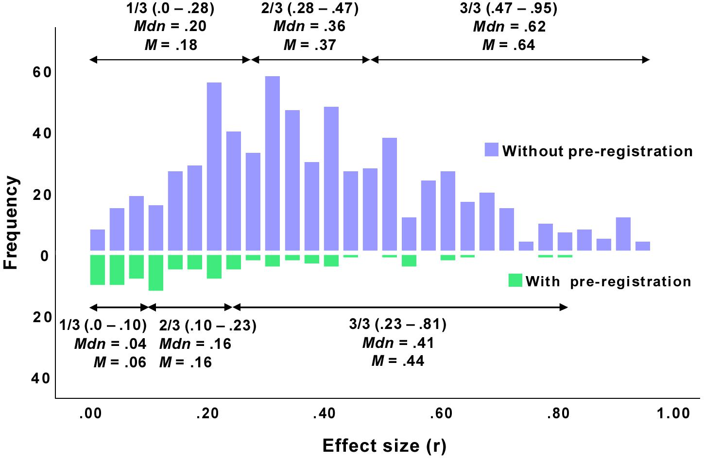
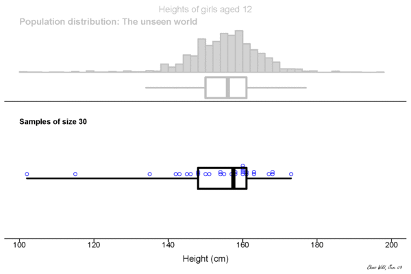
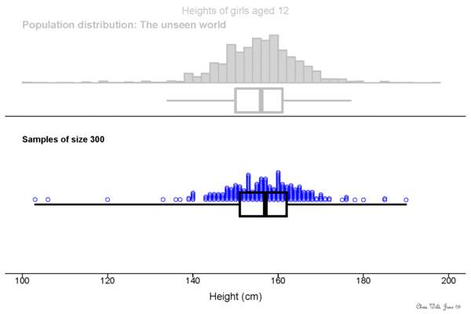

```{r setup, include=FALSE}
knitr::opts_chunk$set(echo = FALSE)

## install.packages('retrodesign')
library(retrodesign)
```

## What is power?

Let's start out with two caveats!

1. We are going to be talking about a term called $\beta$ today. This is not the same thing as model estimates like $\beta_0$ or $\beta_1$. Sorry. We will be extra clear in this talk to discuss model estimates as model estimates.

2. The stuff from today is focused largely around the null hypothesis significance testing framework. Power does exist under Bayesian models, but it's defined somewhat differently. 

## NHST
Let's first consider the most traditional view of power under the null hypothesis significance testing framework.

For this, we need to detour into $p$ values, thinking about what these are in NHST.

$H0$ is our null hypothesis.  For example... My lovely cat is pretty dumb. For example, she doesn't realize that she needs to push on some doors and pull on others. Her odds of running into the door are about 1.

In NHST, I could operationalize this as testing a null hypothesis.

* $H0$ = my cat is not dumb

* $H1$ = my cat is dumb

## NHST
We assess whether data are covered under the null hypothesis, and try to reject it if we can.

We do so by looking at whether the data are likely under the null hypothesis

- $p$ value = the probability that these data (cat hitting doorframe) are true, given $H0$ (cat is not dumb)
  
The typical threshold that is set is $p$ < 0.05

- A value with $p$ < 0.05 is a 'significant' value

- $p$ < 0.05 = an outcome unlikely under the null hypothesis.
  
  - My cat is pretty dumb, measured by her odds of running into the door-frame, $z$ = 4, $p$ < 0.05.

  Reject $H0$: my cat is not, not dumb.
  
  
## Type I error

An outcome unlikely under the null hypothesis is still *possible*  

In fact, it occurs alpha ($\alpha$)% of the time -- 5% of cases!
  
  * Type I error -- a false positive ('I found it' error)


```{r alphaPlot}
## this code is adapted from https://www.statmethods.net/advgraphs/probability.html
mean=0; sd=1; lb=1.65; ub=4

x <- seq(-4,4,length=100)*sd + mean
hx <- dnorm(x,mean,sd)
i <- x >= lb & x <= ub

plot(x, hx, type="n", xlab="", ylab="", axes=F)
lines(x, hx)
polygon(c(lb,x[i],ub), c(0,hx[i],0), col="violet") 
text(2,.02,labels=c("alpha"))
```
  
## Beta
But we care about $H1$ -- the alternate hypothesis. 

Comparing the distributions gives us beta ($\beta$) = the amount of the $H1$ curve below the $\alpha$ threshold.  

This is when we fail to reject $H0$ when in fact, $H1$ is true.

```{r alphabetaPlot}
mean=0; sd=1; lb1=1.65; ub1=4; lb2=-7; ub2=1.65

x <- seq(-4,4,length=100)*sd + mean
x2 <- x+4
hx <- dnorm(x,mean,sd)
i <- x >= lb1 & x <= ub1
j <- x2 >= lb2 & x2 <= ub2

plot(x, hx, type="l", xlab="", ylab="", axes=F,xlim=c(-3.5,7))
par(new=T)
plot(x2, hx, type="l",xlab="", ylab="", axes=F, xlim=c(-3.5,7))
polygon(c(lb1,x[i],ub1), c(0,hx[i],0), col="violet") 
polygon(c(lb2,x2[j],ub2), c(0,hx[j],0), col="lightblue") 
text(0,.2,labels=c("H0"))
text(4,.2,labels=c("H1"))
text(2,.02,labels=c("alpha"))
text(1,.02,labels=c("beta"))

```


  
## Bad betas and betta betas
$\beta$ is the false negative rate (type II or "2 bad ya missed it" error).

If $H0$ and $H1$ are very different, $\beta$ will be small
= few false negatives.

If $H0$ and $H1$ are very similar, $\beta$ will be large
 = many false negatives.
```{r betasPlot}
mean=0; sd=1; lb1=1.65; ub1=4; lb2=-7; ub2=1.65

x <- seq(-4,4,length=100)*sd + mean
x2 <- x-1
hx <- dnorm(x,mean,sd)
j <- x2 >= lb2 & x2 <= ub2
i <- x >= lb1 & x <= ub1

plot(x2, hx, type="l",xlab="", ylab="", axes=F, xlim=c(-6,3))
par(new=T)
plot(x, hx, type="l", xlab="", ylab="", axes=F,xlim=c(-6,3))
polygon(c(lb2,x2[j],ub2), c(0,hx[j],0), col="lightblue") 
polygon(c(lb1,x[i],ub1), c(0,hx[i],0), col="violet") 
text(0.5,.2,labels=c("H0"))
text(-1.5,.2,labels=c("H1"))
text(2,.02,labels=c("alpha"))
text(-1,.02,labels=c("beta"))

```

## Power is 1 - Beta
Power is mathematically defined as 1-$\beta$.  

It is the ability to correctly reject $H0$, the null hypothesis = to find the truth!

Maximise power by minimising false negatives.


```{r powbetaPlot}
mean=0; sd=1; lb1=1.65; ub1=8; lb2=-7; ub2=1.65; 

x <- seq(-4,4,length=100)*sd + mean
x2 <- x+4
hx <- dnorm(x,mean,sd)
i <- x >= lb1 & x <= ub1
j <- x2 >= lb2 & x2 <= ub2
k <- x2 >= lb1 & x2 <= ub1

plot(x, hx, type="l", xlab="", ylab="", axes=F,xlim=c(-3.5,7))
par(new=T)
plot(x2, hx, type="l",xlab="", ylab="", axes=F, xlim=c(-3.5,7))
polygon(c(lb2,x2[j],ub2), c(0,hx[j],0), col="lightblue") 
polygon(c(lb1,x2[k],ub1), c(0,hx[k],0), col="yellow") 
polygon(c(lb1,x[i],ub1), c(0,hx[i],0), col="violet")
text(0,.2,labels=c("H0"))
text(4,.2,labels=c("H1"))
text(2,.02,labels=c("alpha"))
text(1,.02,labels=c("beta"))
text(4,.02,labels=c("power"))

```


## Power is 1 - Beta
So, we want a small $\beta$ value. 

To get this small $\beta$, we want to have a large effect size-- a large difference between the means of the distribution, in relation to the error around them.


```{r powbetaPlot2}
mean=0; sd=1; lb1=1.65; ub1=8; lb2=-7; ub2=1.65; 

x <- seq(-4,4,length=100)*sd + mean
x2 <- x+4
hx <- dnorm(x,mean,sd)
i <- x >= lb1 & x <= ub1
j <- x2 >= lb2 & x2 <= ub2
k <- x2 >= lb1 & x2 <= ub1

plot(x, hx, type="l", xlab="", ylab="", axes=F,xlim=c(-3.5,7))
par(new=T)
plot(x2, hx, type="l",xlab="", ylab="", axes=F, xlim=c(-3.5,7))
polygon(c(lb2,x2[j],ub2), c(0,hx[j],0), col="lightblue") 
polygon(c(lb1,x2[k],ub1), c(0,hx[k],0), col="yellow") 
polygon(c(lb1,x[i],ub1), c(0,hx[i],0), col="violet")
text(0,.2,labels=c("H0"))
text(4,.2,labels=c("H1"))
text(2,.02,labels=c("alpha"))
text(1,.02,labels=c("beta"))
text(4,.02,labels=c("power"))

```

## Effect size estimates

So what's the typical effect size in psychology?


## Effect size estimates

\newline
\newline
... Small to very small  ... 

 .
 
 .
 



For the [full article](https://www.frontiersin.org/articles/10.3389/fpsyg.2019.00813/full) click this link...


     
## Effect size estimates
With small effect size, comes weak power.

And with weak power, comes *mis-estimation of effect size*

Contrast the observed power from 'preregistered' studies (where the researchers laid out a sensible analysis plan ahead of time)


For the [full article](https://www.frontiersin.org/articles/10.3389/fpsyg.2019.00813/full) click this link...


## Sample size and variability
Power relates to sample size because sampling is variable.

With small sample size, the estimate of the $H1$ mean is not very precise. 

Look at how the mean (heavy line) bounces around... This could over-inflate our power estimate. 

  

<small> https://www.stat.auckland.ac.nz/~wild/WPRH/ </small>

## Sample size and variability
With small samples, the estimate of the $H1$ error is also less precise.

Look at how the rectangle (interquartile interval) changes in size more on the left... This decreases power.

  

<small> https://www.stat.auckland.ac.nz/~wild/WPRH/ </small>

## Post-hoc power
This means that observed power calculations on data you have already collected are inherently misleading.

*You don't know whether you had sufficient sample size to accurately observe power.*

In general, this is why we recommend conducting prior power estimates, and against post-hoc observed power calculations.

We will show you how to do these prior power estimates in a bit.

The key is basically seeing whether you would be able to observe an effect of a size that is sensible (the mean/median of several prior studies-- or ~80% of the effect you observed in one prior study).

## Type M/ Type S power
But first, let's think about another form of power.

There's another way of considering whether the study you have designed has the capacity to observe effects reliably.

This connects to an alternate view of power, proposed by Gelman and Carlin (2014)

(http://www.stat.columbia.edu/~gelman/research/published/retropower20.pdf)

  - Type S and Type M errors


## Type S

Type S is an error in *sign*
  
  - Estimating that a result has a positive effect, when in fact the effect is negative (or vice-versa).
  
*Type S errors distort how you think effects work*

  
## Type M

Type M is an error in *magnitude*

  - Estimating that a result has a smaller or larger effect -- but in the same direction as previously estimated.
  
*Type M errors distort how much you think effects matter*

## Calculating type M and type S errors

Gelman and Carlin released some R code for doing these calculations-- which can be informative.  All you need is an effect size estimate and an estimate of error.

These will tell you the likely power of your design.

      library(retrodesign)
      retrodesign(eff,sd)

## How to calculate effect size

Let's pull effect sizes from several of the data sets we've looked at so far. This will be informative for thinking about power in psychology.

Then we'll get the observed power, as well as the expected Type S and Type M error rate, for each of these effects.

## Effect size

Effect size is a measure of how big the effect is with respect to the error around it.

Common effect size measures are:

  - Cohen's $d$ : difference in two means, divided by the pooled standard deviation (for t-test)
  
  - $r^2$ : proportion variance explained in a (fixed effects only!) linear regression
  
  - $\eta^2$ : (eta-squared) sum of squares treatment / sum of squares total (for an ANOVA)
  
Note that all of these are a measure of an effect, related to the amount of error around it.
  

## Effect size

In fact, the ratio of an estimate to its error is an effect size measure-- aka, the t-value. *We already have these for all of our effects of interest, from the MEMs run earlier*

These are the best-case estimates, given the reported numbers:

|Data set | Effect | Estimate | Error (SE) | t or z-value|
|---|---|---|---|---|
Titanic | Age | 0.011 | 0.005 | 2.06
Lexdec | NativeLanguage : Frequency | 0.030 | 0.009 | 3.26
Sleepstudy | Days | 10.47 | 1.55 | 6.66
Chicks | Caesin vs Horsebean | 163.38 | 23.27 | 7.02


## Effect size

In fact, the ratio of an estimate to its error is an effect size measure-- aka, the t-value. 

Note that we could have overestimated the size of each of the effects, if the study were underpowered.  

Using retrodesign, we might run an observed power calculations on the estimate of the reported size, and one 80% smaller.

|Data set | Effect | Estimate | Error (SE) | t or z-value|
|---|---|---|---|---|
Titanic | Age | 0.011 | 0.005 | 2.06
Lexdec | NativeLanguage : Frequency | 0.030 | 0.009 | 3.26
Sleepstudy | Days | 10.47 | 1.55 | 6.66
Chicks | Caesin vs Horsebean | 163.38 | 23.27 | 7.02


## Type S and Type M power calculations: Titanic::Age

Use retrodesign() to estimate power, type S, and type M errors.

We will input our estimates for fixed effects and SE around them into this function.

```{r echo=TRUE}
retrodesign(.011,.005)
```

This give us:

the observed power of Age (probability that we would see a significant effect were we to replicate the experiment)
  
   - the maximum power of the design is not bad-- but doesn't meet usual standards (80%)

the type S error (probability the replicated effect would have the incorrect sign)

   - it's very unlikely that we observe a type S error!
  
the exaggeration ratio of replicated effects (or expected type M error)

   - and we we lightly expect the replication to have a smaller effect.

## Type S and Type M power calculations: Titanic::Age

What happens when we reduce the effect estimate? 

```{r echo=TRUE}
tt <- cbind(retrodesign(.011,.005),retrodesign(.8*.011,.005))
colnames(tt)<-c('Original','x80percent')
tt
```

These are:

the observed power (probability that we would see a significant effect were we to replicate the experiment)
  
the type S error (probability the replicated effect would have the incorrect sign)

the exaggeration ratio of replicated effects (or expected type M error)
 
 - Interpret: what happens?
 
## Type S and Type M power calculations: Chicks:: Caesin vs Horsebean

Here's what happens with a model that has a larger effect size: Note how observed power changes less.

```{r echo=TRUE}
tt <- cbind(retrodesign(163.38,23.27),retrodesign(.8*163.38,23.27))
colnames(tt)<-c('Original','x80percent')
tt
```
 
## Type S and Type M power by effect sizes

I ran this function for each estimate and SE, and put the type S and type M rates in the table.

|Data set | Effect | Estimate | Error (SE) | t or z-value| type S | exaggeration |
|---|---|---|---|---|---|---|
Titanic | Age | 0.011 | 0.005 | 2.06 | 0.00004 (3.96e-05) | 1.30
Lexdec | NativeLanguage : Frequency | 0.030 | 0.009 | 3.26 | 0.00000007 (6.56e-08) | 1.05
Sleepstudy | Days | 10.47 | 1.55 | 6.66 | 1.46e-18 | 0.99
Chicks | Caesin vs Horsebean | 163.38 | 23.27 | 7.02 | 1.34e-19 | 1.00


## Take-home points: Power

Many studies have suprisingly low power. 

Being off on the estimate of the effect size can really matter for observed power-- the best power estimate you could think to get.

As such, it's really important to design studies in a way that maximises power-- test large effect sizes, with appropriate sample sizes.


## How to estimate power of a full mixed model
For a-priori power calculations, sometimes what you instead want to know is how much data to collect: how many particpants? how many items?

You can do this with other tools-- bigger and better tools! 

We recommend that you...

* use simr() package

* or, hand-code simulations ( https://github.com/RLadiesNijmegen/Power )

* or, use Jake Westfall's PANGEA (https://jakewestfall.shinyapps.io/pangea/ )

We encourage you to work through this on your own.